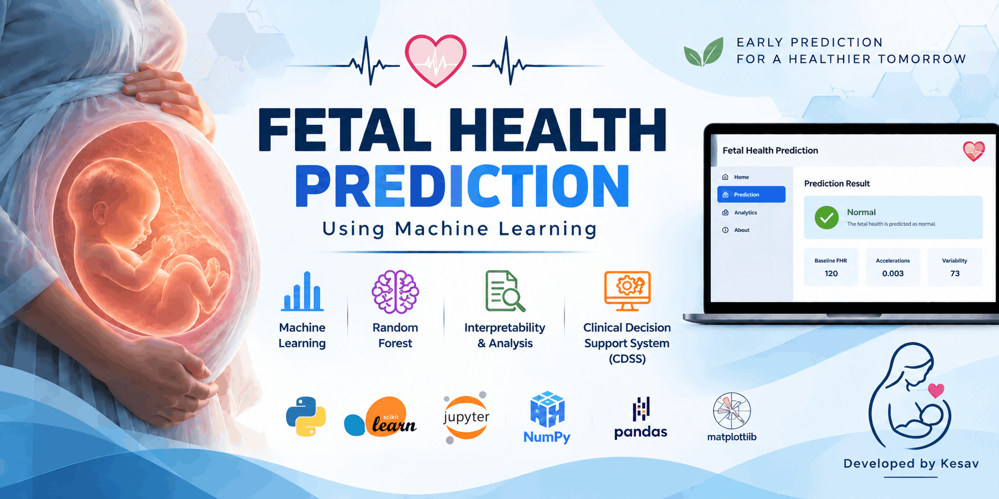
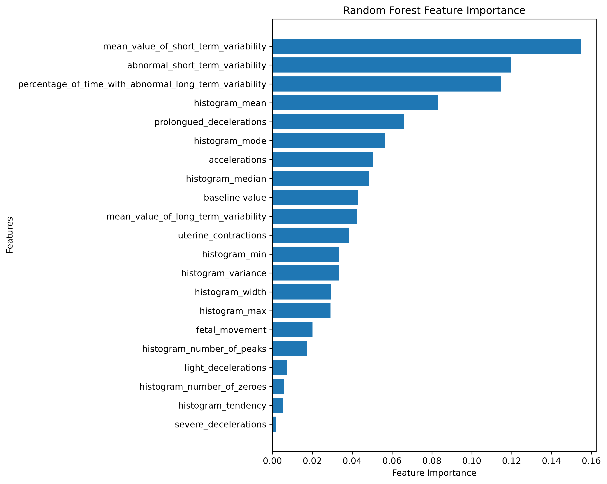

# Fetal Health Prediction Using Machine Learning

<p align="center">
  
</p>

## 📖 Project Overview

This project focuses on predicting fetal health conditions using Machine Learning techniques applied to Cardiotocography (CTG) data. The system classifies fetal health into three categories:

- Normal
- Suspect
- Pathological

The project follows the methodology presented in the selected base paper and implements data preprocessing, exploratory data analysis, multiple machine learning classification models, hyperparameter tuning, model evaluation, feature importance analysis, and a Clinical Decision Support System (CDSS)-oriented recommendation module.

---

## 🎯 Objective

The main objectives of this project are:

- To analyze fetal health using CTG-based data.
- To preprocess and prepare the dataset for machine learning.
- To perform exploratory data analysis (EDA).
- To train and compare multiple classification algorithms.
- To perform hyperparameter tuning using cross-validation.
- To identify the best-performing model.
- To analyze important features influencing the model predictions.
- To implement a CDSS-oriented prediction and recommendation module.

---

## 📄 Base Paper

**Title:**  
_Machine learning-driven fetal health prediction: An integrated model with clinical decision support_

The project is developed with reference to the methodology and experimental framework presented in the base paper.

The base paper investigates machine learning models for fetal health classification and proposes an integrated framework involving:

- Exploratory Data Analysis
- Random Forest classification
- Model evaluation
- Feature importance / interpretability
- Clinical Decision Support

---

## 📊 Dataset

The project uses the **Fetal Health Classification** dataset based on Cardiotocography (CTG) measurements.

### Dataset Information

- Original records: **2126**
- Input features: **21 CTG features**
- Target variable: `fetal_health`
- Classes:
  - `1` → Normal
  - `2` → Suspect
  - `3` → Pathological

After duplicate removal, the working dataset contains **2113 records**.

### Dataset Location

```text
01_dataset/
└── 01_raw/
    └── fetal_health.csv
```

---

## 🔬 Methodology

The implemented workflow consists of the following stages:

1. Data Understanding
2. Exploratory Data Analysis (EDA)
3. Data Preprocessing
4. Model Training
5. Hyperparameter Tuning
6. Model Evaluation
7. Feature Importance Analysis
8. Clinical Decision Support System (CDSS)

---

## ⚙️ Data Preprocessing

The preprocessing stage includes:

- Loading the fetal health dataset.
- Removing duplicate records.
- Separating input features and the target variable.
- Splitting the dataset into training and testing sets using an 80:20 ratio.
- Applying `StandardScaler` to the input features.

---

## 🤖 Machine Learning Models

The following classification models were implemented and evaluated:

- Random Forest
- Gradient Boosting
- Support Vector Machine (SVM)
- K-Nearest Neighbors (KNN)
- Bagging Random Forest
- Bagging Gradient Boosting
- Decision Tree
- Equal Soft Voting
- Weighted Soft Voting

---

## 🔧 Hyperparameter Tuning

Hyperparameter tuning was performed using **GridSearchCV with 5-fold cross-validation**.

The tuning process was used to identify suitable model configurations and compare their performance.

The Random Forest model was configured using the paper-aligned parameters, including:

- `n_estimators`
- `max_depth`
- `criterion`
- `bootstrap`
- `random_state`

---

## 📈 Model Evaluation

The models were evaluated using:

- Accuracy
- Precision
- Recall
- F1-score
- Cross-validation score
- Confusion matrix

### Test Accuracy Results

| Model                     | Test Accuracy |
| ------------------------- | ------------: |
| Random Forest             |    **97.16%** |
| Gradient Boosting         |        96.69% |
| SVM                       |        94.80% |
| KNN                       |        92.43% |
| Bagging Random Forest     |        95.74% |
| Bagging Gradient Boosting |    **97.16%** |
| Decision Tree             |        93.62% |
| Equal Soft Voting         |        96.69% |
| Weighted Soft Voting      |    **97.16%** |

### 📊 Random Forest Feature Importance



### 🏆 Best Model

The Random Forest classifier achieved a test accuracy of **97.16%** in the implemented experiment and was selected as the final model for the paper-aligned CDSS implementation.

> Note: Weighted Soft Voting also achieved 97.16% test accuracy in the implemented experiment. However, Random Forest is used as the final CDSS model to maintain alignment with the proposed model in the base paper.

---

## 🧠 Feature Importance

Random Forest feature importance was used to analyze the relative contribution of the CTG features to the model.

The feature importance results are saved in:

```text
05_results/
└── random_forest_feature_importance.csv
```

The corresponding visualization is saved in:

```text
07_images/
└── random_forest_feature_importance.png
```

---

## 🏥 Clinical Decision Support System (CDSS)

The CDSS module uses the trained Random Forest model to:

1. Accept CTG feature values as input.
2. Apply the saved preprocessing scaler.
3. Predict the fetal health class.
4. Calculate prediction probabilities.
5. Display model confidence.
6. Provide a class-based recommendation.

### Prediction Classes

| Class | Prediction   | Recommendation                                |
| ----- | ------------ | --------------------------------------------- |
| 1     | Normal       | Continue routine fetal monitoring.            |
| 2     | Suspect      | Immediate clinical evaluation is recommended. |
| 3     | Pathological | Urgent clinical intervention is recommended.  |

The CDSS implementation is available in:

```text
02_notebooks/
└── 06_cdss.ipynb
```

---

## 📁 Project Structure

```text
fetal-health-prediction/
│
├── 01_dataset/
│   └── 01_raw/
│       └── fetal_health.csv
│
├── 02_notebooks/
│   ├── 01_Data_understanding.ipynb
│   ├── 02_EDA.ipynb
│   ├── 03_preprocessing.ipynb
│   ├── 04_model_training.ipynb
│   ├── 05_hyperparameter_tuning.ipynb
│   └── 06_cdss.ipynb
│
├── 03_src/
│
├── 04_models/
│   ├── random_forest_model.pkl
│   ├── gradient_boosting_model.pkl
│   ├── svm_model.pkl
│   ├── knn_model.pkl
│   ├── bagging_rf_model.pkl
│   ├── bagging_gb_model.pkl
│   ├── decision_tree_model.pkl
│   ├── equal_soft_voting_model.pkl
│   ├── weighted_soft_voting_model.pkl
│   └── scaler.pkl
│
├── 05_results/
│   ├── model_evaluation_results.csv
│   └── random_forest_feature_importance.csv
│
├── 06_docs/
│
├── 07_images/
│   └── random_forest_feature_importance.png
│
├── .gitignore
├── README.md
└── requirements.txt
```

---

## 🛠️ Technologies Used

- Python
- Jupyter Notebook
- Pandas
- NumPy
- Matplotlib
- Seaborn
- Scikit-learn
- Joblib
- Git
- GitHub

---

## ▶️ How to Run

Clone the repository:

```bash
git clone https://github.com/kesav-dev/fetal-health-prediction.git
```

Navigate to the project:

```bash
cd fetal-health-prediction
```

Install the required Python packages:

```bash
pip install -r requirements.txt
```

Launch Jupyter Notebook:

```bash
jupyter notebook
```

Run the notebooks in the following order:

```text
01_Data_understanding.ipynb
        ↓
02_EDA.ipynb
        ↓
03_preprocessing.ipynb
        ↓
04_model_training.ipynb
        ↓
05_hyperparameter_tuning.ipynb
        ↓
06_cdss.ipynb
```

---

## 📌 Important Output Files

### Trained Models

```text
04_models/
```

Contains the trained machine learning models and the scaler used for preprocessing.

### Model Evaluation

```text
05_results/model_evaluation_results.csv
```

Contains the evaluation results of the implemented models.

### Feature Importance

```text
05_results/random_forest_feature_importance.csv
```

Contains the Random Forest feature importance values.

### Feature Importance Visualization

```text
07_images/random_forest_feature_importance.png
```

---

## ⚠️ Limitations

The project is based on a publicly available fetal health dataset and is intended for academic and research purposes. The dataset may not fully represent the diversity of real-world clinical populations.

Further validation using larger and real-world hospital datasets would be required before considering practical clinical deployment.

---

## 🔮 Future Improvements

Possible future improvements include:

- Validation using real-world hospital data.
- Larger and more diverse datasets.
- Advanced ensemble learning techniques.
- Improved model interpretability.
- A web-based CDSS interface.
- Real-time CTG data integration.
- Additional clinical validation.

---

## 📚 Reference

Abed, S., & Alshayeji, M. H.  
_Machine learning-driven fetal health prediction: An integrated model with clinical decision support._  
Journal of Engineering Research, 2026.

---

## 👨‍💻 Authors

- Kesav — [GitHub](https://github.com/kesav-dev) | [Email](mailto:kesavanath97@gmail.com)
- Barath

---

## 📜 License

This project is licensed under the MIT License. See the `LICENSE` file for details.

---

## ⚠️ Disclaimer

This project is developed for academic and research purposes only.

The predictions and recommendations generated by the system are not intended to replace professional medical diagnosis or clinical decision-making.
